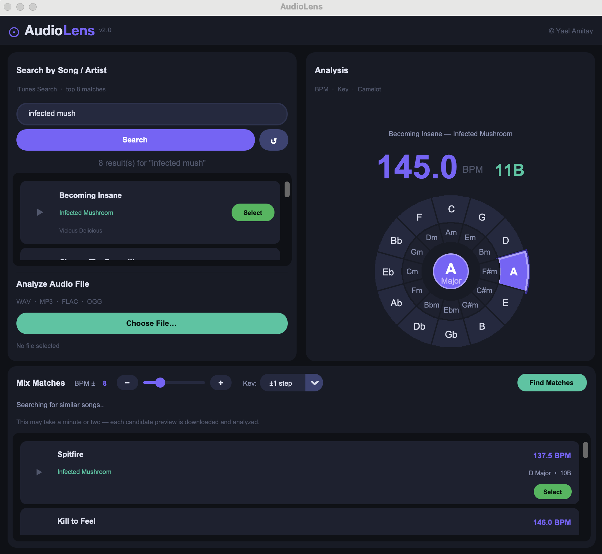

# ⊙ AudioLens v2.0

**A desktop application for BPM and musical key analysis, built for DJs and music producers.**

🌐 **Live website:** [audiolens.netlify.app](https://audiolens.netlify.app)



> ⚠️ **This is v2.0 — an experimental release.** BPM and key detection may be inaccurate on some tracks. Mix Matches results are algorithmic and not always harmonically perfect. Expect bugs. Feedback is very welcome.

---

## What's New in v2.0

| Feature | Description |
|---|---|
| 🎛️ **Mix Matches** | Find harmonically compatible songs by BPM tolerance and Camelot key. Select any match and search again — drill down endlessly. |
| 🎡 **Camelot Wheel** | Full harmonic mixing wheel. Every detected key shows its Camelot position (e.g. 8B, 4A) for seamless DJ transitions. |
| 🎵 **Better Key Detection** | Uses Librosa's CQT-based `chroma_cens` when available — far more accurate than v1's STFT-only chromagram. |
| 🥁 **Improved BPM Detection** | Combined autocorrelation + FFT analysis with multi-band envelope. Handles half-tempo and double-tempo artifacts. |
| ▶️ **Preview Playback** | Play 30-second previews directly from search results. Click again to stop. |
| 🎸 **Genre-Aware Search** | Auto-detects Goa, Psytrance, Techno, House, D&B, Hip-Hop and more. Mix Matches searches within your genre automatically. |
| 🎵 **iTunes-only Search** | No credentials required — search works out of the box. |

---

## What It Does

AudioLens analyzes songs and audio files to detect **BPM (tempo)** and **musical key**, then displays the result on an interactive **Circle of Fifths** with Camelot labels. The **Mix Matches** panel finds harmonically compatible songs you can mix into your current track.

Search for any song by name or artist, or upload a local audio file. Once a song is analyzed, click **Find Matches** to discover compatible tracks — then select any match to make it the new reference and search again.

---

## Key Features

- 🔍 **Song Search** — iTunes-powered search (dual parallel requests for better results); no API credentials required
- 🎵 **BPM Detection** — Multi-band autocorrelation + FFT on onset envelopes; handles short previews and double/half-tempo artifacts
- 🎹 **Key Detection** — CQT-based chroma (`chroma_cens` via Librosa when available); falls back to STFT chromagram with Krumhansl–Schmuckler + Temperley + Shaath blended profiles
- 🎡 **Circle of Fifths + Camelot** — Live canvas highlighting detected key with Camelot position label
- 🎛️ **Mix Matches** — BPM ± tolerance slider, key compatibility selector (same key / ±1 / ±2 steps), genre-aware artist pool
- 📁 **File Upload** — Analyze any local WAV, MP3, FLAC, OGG, or AIF file
- ▶️ **Preview Playback** — 30-second iTunes previews with stop/start toggle
- 🌗 **Dark UI** — Splash screen, animated loading states, responsive layout

---

## Tech Stack

| Layer | Technologies |
|---|---|
| Language | Python 3.11 |
| GUI | CustomTkinter, Tkinter Canvas |
| Audio DSP | NumPy, SciPy, SoundFile, Librosa |
| Networking | requests, concurrent.futures |
| Build | PyInstaller (Mac + Windows), GitHub Actions |
| Website | HTML, CSS, JavaScript — deployed on Netlify |

---

## Running from Source

**Requirements:** Python 3.9+

```bash
git clone https://github.com/yaelam6/audiolens-build.git
cd audiolens-build
pip install -r requirements.txt
python audioLens.py
```

---

## Project Structure

```
audioLens.py              # Main application — all logic and UI (v2.0)
AudioLens.spec            # PyInstaller build spec for macOS
AudioLens-Windows.spec    # PyInstaller build spec for Windows
AudioLens.icns            # macOS app icon
create_icon_win.py        # Icon generation utility for Windows build
requirements.txt          # Python dependencies
index.html                # Project landing page (deployed to Netlify)
.github/workflows/        # GitHub Actions CI workflow (Windows build)
```

---

## Known Limitations & Bugs (v2.0)

> This is an experimental release. The following are known issues:

- **BPM accuracy on short previews** — DSP runs on 30-second clips. Half/double-tempo errors are common on certain genres.
- **Key detection inaccuracies** — Chromagram-based key detection is a hard problem. Results are reliable for most electronic music but may be wrong on complex harmonic content.
- **Mix Matches false positives** — Matches are filtered by BPM + Camelot but not all will actually mix well. Treat results as suggestions.
- **Genre misclassification** — Genre detection is heuristic (BPM + iTunes genre tag + artist name). Edge cases exist.
- **No internet, no search** — Song search and preview analysis both require a network connection.
- **macOS SSL warnings** — `InsecureRequestWarning` is suppressed; known issue with system Python SSL on some macOS versions.
- **Spotify audio-features** — Spotify restricted `/audio-features` for new apps (late 2024). The Spotify mix-search path is currently unused; iTunes is the primary backend.

---

## Development Approach

This project was developed using a **vibe coding** workflow with [Claude Code](https://claude.ai/code), combining AI-assisted development with human product thinking, feature planning, testing, and iteration. All product decisions, UX choices, testing, and debugging direction were driven by the developer; Claude Code was used as a pair-programming assistant for implementation, refactoring, and technical problem-solving.

---

## License

MIT License — see [LICENSE](LICENSE) for details.

---

*Made with ♥ by [Yael Amitay](mailto:yaelam6@gmail.com)*
